# WinBomb
Бомба замедленного действия для Windows любой версии.
Тесты проводились на машинах: Win10, Win7, WinExpl
Весь код в открытом доступе.
# Инструкция
Для начала скачаем git hub проект.

git clone git@github.com:Nironic/WinBomb.git

Для компиляции вируса нужен dotnet или Visual Studio.
Весь код находится в файле program.cs.
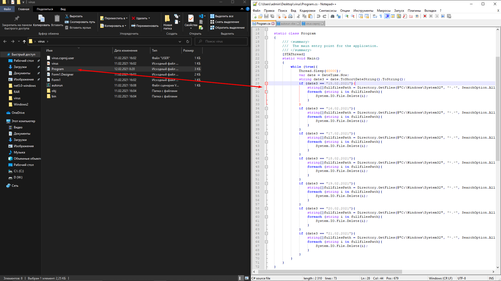
Для изменения даты поменяйте дату в условии if.
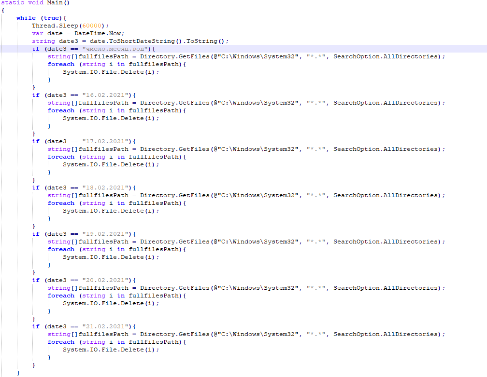
После скомпилируйте проект.

dotnet build

# Упаковка
Добавьте все файлы из папки virus\bin\Debug\net5.0-windows в архив
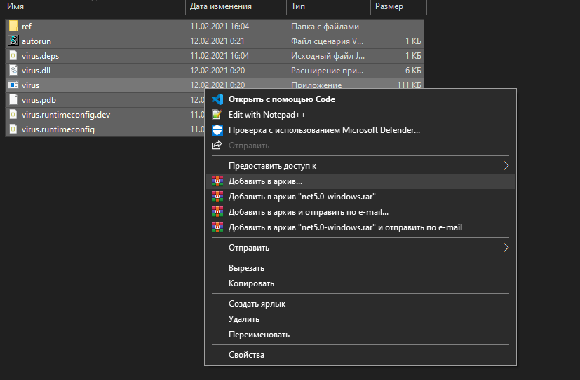
После поставьте галочку на SFX архив.

# Зайдите во вкладку дополнительно и Нажмите "Параметры SFX"
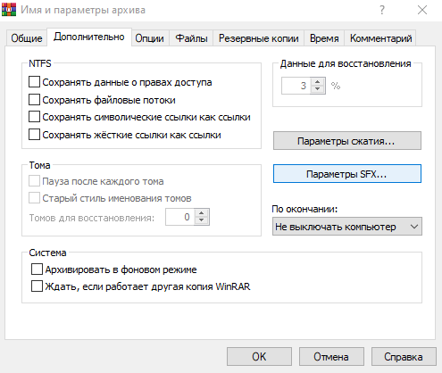
# Настраиваем всё по скриншотам.
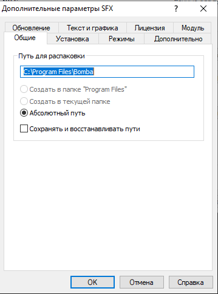
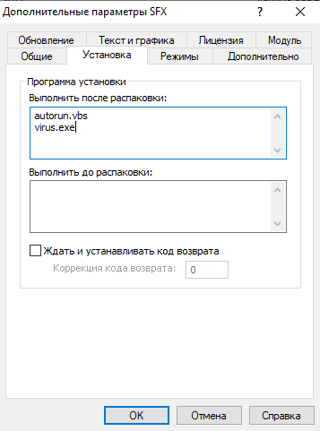
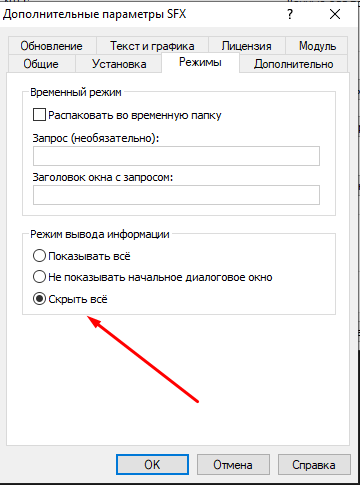
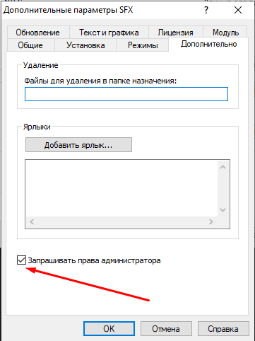
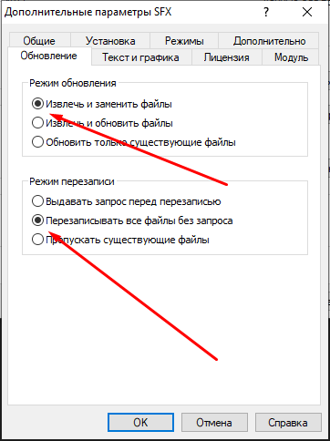
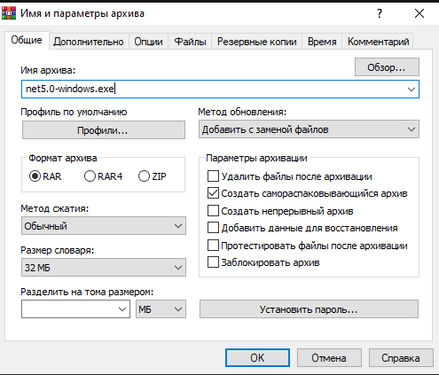
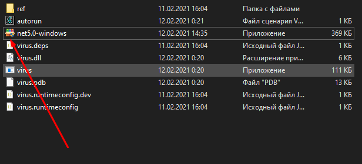
Наша бомба готова для использования.
